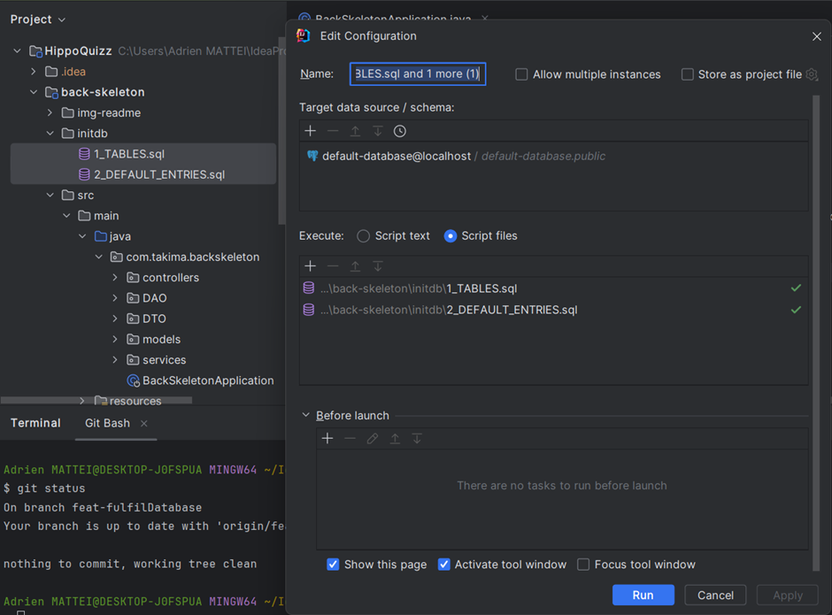

Pour lancer le projet : 

- Sur Docker : 
  - Run le conteneur BACKSKELETON
  

- Sur le Back (IntelliJ)
  - RUN back-skeleton/initdb : 
    1_Tables.sql et 2_Default_entries.sql
  
    
  - RUN back-skeleton/src/main/java/com.takima…/BackSkeletonApplication.java
  

- Sur le Front (VS Code)
  - Dans le terminal : cd epf-front-skeleton-main
  - Dans le terminal : npm start

Enfin, se connecter sur le navigateur : localhost:4200

Pour créer un Quiz :

- Sur le site :
  - Cliquer sur Admin
  - Quiz
  - New
  - Renseigner le titre et la description du Quiz et enregistrer
  - Une fois créé celui-ci ne sera pas visible dans la liste des Quiz jouables
  - Il ne sera uniquement visible via la page admin (localhost:4200/quiz-configuration) depuis laquelle il faudra double cliquer pour y ajouter les questions et réponses.

- Sur le Front (VS Code) :
  - Aller dans epf-front-skeleton-main/assets/	images
  - Créer un nouveau dossier. Exemple vous venez de créer votre premier Quiz donc créer un dossier 6 (car c’est le 6e Quiz étant donné que 5 étaient déjà existants).
  - Y insérer les 10 photos dans l’ordre des questions (ex : photo n°1 pour question n°1 etc.). Elles doivent être au format png et suivre la nomenclature existante (1.png, 2.png, 3.png, etc.)