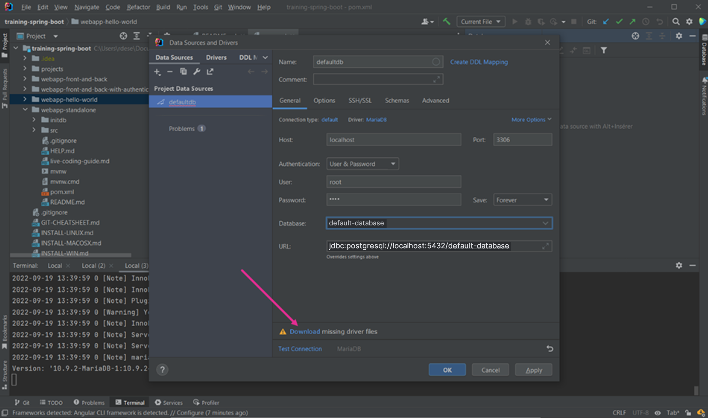
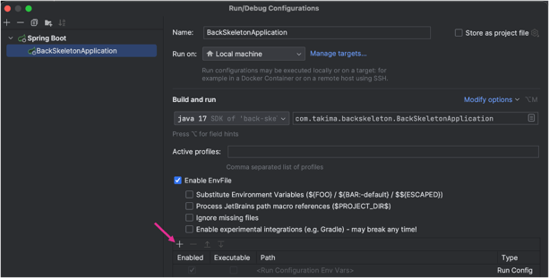

PROJET DE TECHNOLOGIE WEB
============================================================
Nom de la matière : TECHNOLOGIE WEB (SPRING BOOT + ANGULAR)

Nom de l'enseignant : Monsieur BLANDIN Thomas

Date : 12 Mai 2024

Auteurs :
  - Mehdi ABERKANE | mehdi.aberkane@edu.ece.fr
  - Hippolyte CACHEUX | hippolyte.cacheux@edu.ece.fr
  - Adrien MATTEI | mattei.adrien@edu.ece.fr

Groupe :
APPRENTI INGENIEUR 4 - SYSTEME D'INFORMATION ET CYBERSECURITE - GROUPE 3

------------------------------------------------------------------------------------------------------

### LANCEMENT DU PROJET :

1. **Clonage du Projet :**

  Clonez notre projet depuis la branche principale de notre dépôt GitHub : https://github.com/ArkhanGLHF/HippoQuizz.git.
  
  Une fois le clonage effectué, ouvrez vos IDEs. 
  Idéalement, utilisez :
  - IntelliJ pour la partie back-end du projet
  - Visual Studio Code pour la partie front-end 
  - Docker pour la gestion de la base de données.

2. **Partie Back-end :**

   - Dans IntelliJ, ouvrez le projet cloné et paramétrez la même structure de projet que celle indiquée dans les consignes du projet.
   - Ouvrez un terminal et naviguez vers le sous-dossier `back-skeleton` avec la commande `cd back-skeleton`.
   - Créez la base de données "default-database" en suivant les instructions fournies dans l'image ci-dessous :

     
    
   - Une fois la connexion avec la base de donnée établie, lancez le fichier docker-compose contenu dans le dossier avec la commande : `docker-compose up`.
   
   - Après le lancement du conteneur BACKSKELETON, remplissez la base de données en exécutant les fichiers SQL du dossier `back-skeleton/initdb` dans l'ordre suivant :
     1. `1_Tables.sql`
     2. `2_Default_entries.sql`

     Une fois la base de données créée et le conteneur Docker lancé, ajoutez un fichier `.env` au dossier `back-skeleton` contenant les éléments suivants :
        - DATABASE_USER=root
        - DATABASE_PASSWORD=toor 
        - DATABASE_NAME=default-database

Liez ce fichier au projet en cliquant sur "Run Configuration" après avoir éffectué un clic droit sur le fichier `BackSkeletonApplication.java` située dans `src/main/java/com.takima.backskeleton`
, puis en suivant la procédure décrite dans les images suivantes :

 
 
 

Enfin, exécutez l'application Java en lançant la classe `BackSkeletonApplication.java` située dans `src/main/java/com.takima.backskeleton`.

3. **Partie Front-end :**

   - Ouvrez le projet `HIPPOQUIZZ` dans Visual Studio Code.
   - Installez les dépendances nécessaires :

     - Node.js : https://nodejs.org/en/download
     - Angular : `npm install -g @angular/cli`

   - Dans un terminal, naviguez vers le dossier `epf-front-skeleton-main` avec la commande : `cd epf-front-skeleton-main`.
   - Pour lancer le projet, utilisez `npm start` et rendez-vous sur http://localhost:4200/.

----------------------------------------------------------------------------------------------------

### NOTE À L'ENSEIGNANT :

Pour ajouter des images aux questions de votre quiz suivez ces étapes :

- Depuis la page http://localhost:4200/quiz-configuration/, accessible en cliquant sur "Admin" puis "Quiz", vous avez créé un quiz et ses questions.
  1. En renseignant dans un premier temps le titre et la description du quiz.
  2. Puis en complétant les 10 questions et réponses.

Une fois le formulaire validé, le quiz et ses questions ont été créés, mais sans images.

- Pour les ajouter, rendez-vous dans l'un des IDEs :

  - Naviguez vers le sous-dossier : epf-front-skeleton-main/assets/images.
  - Créez un nouveau sous-dossier numéroté en fonction du numéro du quiz (par exemple, créez le dossier "6" pour le sixième quiz, si 5 quizs existent déjà).
    - Pour connaitre le numéro du quiz : 
      - consulter la base de donnée depuis laquelle vous pourrez voir son id
    - ou alors,
      - regarder l'id présent dans l'url lorsque vous accecdez à la page details d'un quiz en cliquant sur l'un d'eux depuis la page  http://localhost:4200/quiz-configuration/.
  - Une fois le dossier avec le bon nom créé, ajoutez les 10 images de vos questions dans ce sous-dossier, en les nommant dans l'ordre des questions (par exemple : 1.png, 2.png, 3.png, etc.), au format PNG.

Vous avez ainsi créé votre premier quiz avec des images !
